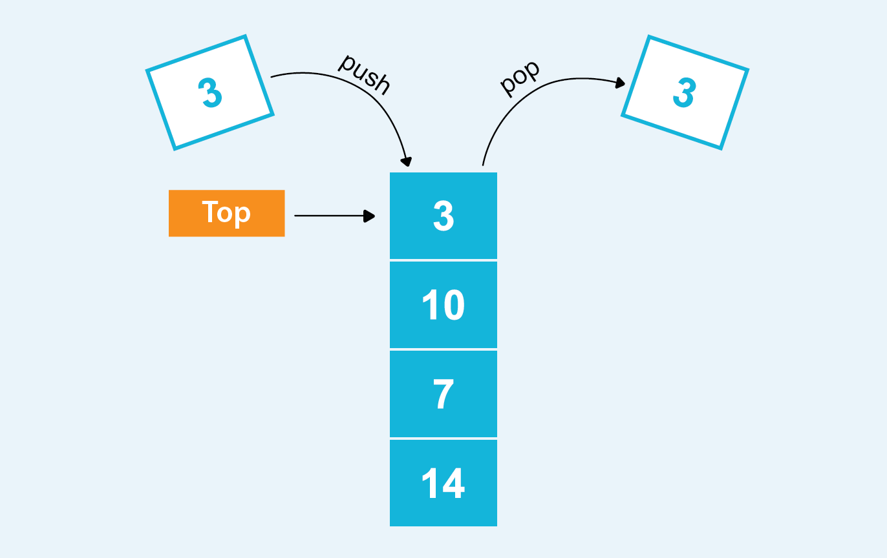

# Stack
### whenever you are using for loops it's important that you remember the big O notation. How you use for loops can determine how fast whatever you're programming loads. 
Having a for loop by itself will give you the fastest load times, having 2 loops not withing each other will give you a slower time, and having a loop within a loop will give you the slowest time.
One for loop can be written as 0(n), two loops not intertwined can be written as 0(2n), and a loop within a loop can be written as 0(n^2)

A stack is a linear data structure that stores items in a last in first out manner so that when a new element is added it will be the first gone. This is usually reffered to as push and pop.

The functions associated with stack are:

* empty() – Returns whether the stack is empty
* size() – Returns the size of the stack
* top() / peek() – Returns a reference to the topmost element of the stack
* push(a) – Inserts the element ‘a’ at the top of the stack
* pop() – Deletes the topmost element of the stack

to work with a stack we will first create a list
```python
stack = []
```
then we can use the append function to add to this list
```python
stack.append('a')
stack.append('b')
stack.append('c')
```
The list should now print a, b, and c

now if we wanted to remove the last letter that was added to the stack we would use the pop function
```python
print(stack.pop())
```
this should give us an outcome of the following
```
outcome: c
```
The outcome was c because it was the last added element and since stacks follow a last in first out manner it was the first to go

then if we are to pop all of the remaining elements
```python
stack.pop()
stack.pop()
```
we would have an empty stack and could check to see if it's empty by running the empty function
```python

print("\nEmpty: ", stack.empty())
```
entering that line will give us the following outcome
```
Empty: true
```
it returns true because there is nothing left in the stack and it is empty
## Problem

### Create a function using stacks that will remove any duplicate letters in a word for example dad should return a

you can check your solution here [solution](StackSolution.py)


[Back to Welcome Page](0-welcome.md)