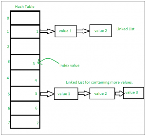

# Set
### sets are just an unfiltered collection of data that has no duplicate elements. We are able to iterate through and mutate elements. The reason we use sets instead of lists is because they make it easier to find if an element is in a set of data


below is an example of a set
```python
myset = set(["a", "b", "c"])
print(myset)
```

```python
outcome: {'c', 'b', 'a'}
{'d', 'c', 'b', 'a'}
```

Let's say we have a list of names
```python
people = {"Jay", "Idrish", "Archi"}
```
if we wanted to add onto this list we could use the add function. Let's say we wanted to add the name Derik to the set we would do it through the following:

```python
people.add("Derik")
```
using the add command here would add the name Daxit to the set and we would get the following
```python
outcome: {'Idrish', 'Archi', 'Jay', 'derik'}
```
and if we wanted to add numbers through a for loop we would do it through the following
```python
for i in range(1, 6):
    people.add(i)
```
which would give us the end result of 
```python
{1, 2, 3, 4, 5, 'Idrish', 'Archi', 'Jay', 'Daxit'}
```
When we work with sets we often are using 2 or more. If we have more than one set we can join them, find common elements, or different ones. 

for example if we had two sets of numbers and wanted to only join the numbers from the first set not in the second we would do the following
```python
def NoRepeats(set1, set2):
    """ this function exludes numbers that are found in the second set"""
    repeats = [x for x in set1 if x not in set2]
    return repeats
```
so that when we run the following test
```python
s1 = {1,2,3,4,5}
s2 = {4,5,6,7,8}
print(NoRepeats(s1,s2))  # Should show {4, 5}
```
we'll get this outcome
```python
[1, 2, 3]
```
## Problem

### Create a function to see if two sets have atleast one element in common, for example if two sets each contain the number 2 it should return true
You can check your solution here [solution](Stacksolution.md)

[back to welcome page](0-Welcome.md)