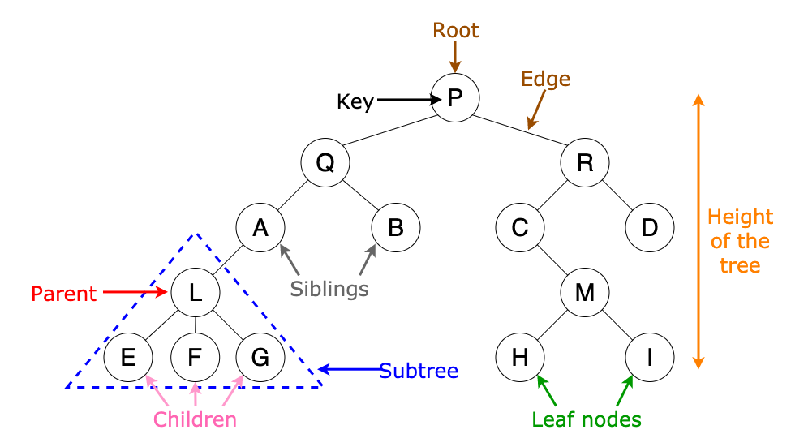

# Tree

### In a non linear data structure trees represent nodes connected by edges. A binary tree is a tree where each node can have a maximum of 2 child nodes. Each node in a binary tree holds data that refers to it's child nodes. 
* Root Node: Root node is the topmost node of a tree. It is always the first node created while creating the tree and we can access each element of the tree starting from the root node
* Parent Node: The parent of any node is the node which references the current node
* Child Node: Child nodes of a parent node are the nodes at which the parent node is pointing using the references
* Edge: The reference through which a parent node is connected to a child node is called an edge


Each child node is referred to as left and right child according to their postition. We can get different parts of the data using code like the following

 Note: If left or right child node is not an instance of binarytree.Node class then binarytree.exceptions.NodeTypeError is raised and if the node value is not a number then binarytree.exceptions.NodeValueError is raised.
Example:
```python

from binarytree import Node
root = Node(3)
root.left = Node(6)
root.right = Node(8)
 
# Getting binary tree
print('Binary tree :', root)
 
# Getting list of nodes
print('List of nodes :', list(root))
 
# Getting inorder of nodes
print('Inorder of nodes :', root.inorder)
 
# Checking tree properties
print('Size of tree :', root.size)
print('Height of tree :', root.height)
 
# Get all properties at once
print('Properties of tree : \n', root.properties)
```
this code will tell us about the data and give us the following outcome
```python
Binary tree : 
3 
/ \ 
6 8
List of nodes : [Node(3), Node(6), Node(8)]
Inorder of nodes : [Node(6), Node(3), Node(8)]
Size of tree : 3
Height of tree : 1
Properties of tree : 
{‘height’: 1, ‘size’: 3, ‘is_max_heap’: False, ‘is_min_heap’: True, ‘is_perfect’: True, ‘is_strict’: True, ‘is_complete’: True, ‘leaf_count’: 2, ‘min_node_value’: 3, ‘max_node_value’: 8, ‘min_leaf_depth’: 1, ‘max_leaf_depth’: 1, ‘is_bst’: False, ‘is_balanced’: True, ‘is_symmetric’: False}
```
## Problem

### Create a function that deletes a node with the given key in a given Binary search tree (BST).

Note: Search for a node to remove. If the node is found, delete the node.

You can check your solution here [solution](TreeSolution.md)

[welcome](0-welcome.md)
